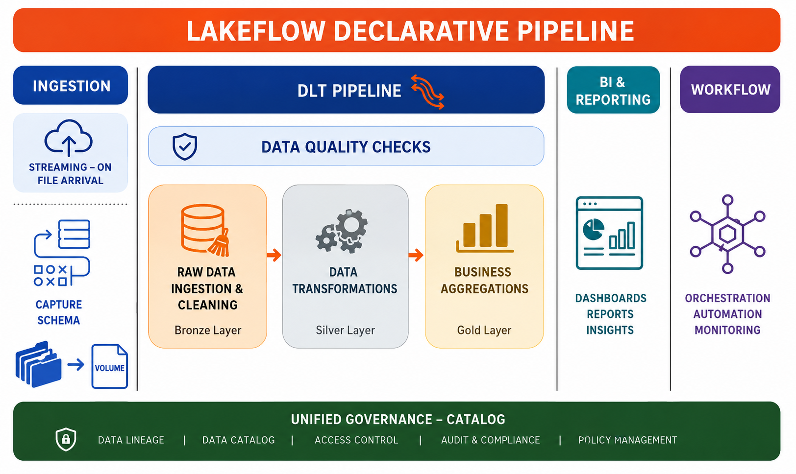

# Automated-Banking-ETL-Pipeline-using-Databricks
A modern **Lakeflow Declarative Pipeline** built on **Databricks Delta Live Tables (DLT)** that automates data ingestion, validation, transformation, aggregation, and reporting using the Medallion Architecture.

## Overview
This project demonstrates an end-to-end data engineering pipeline using **Databricks Lakeflow Declarative Pipelines (DLT)**.
The pipeline automatically:
- Ingests data when files arrive
- Applies schema inference and evolution
- Performs data quality validation
- Cleans and transforms raw data
- Creates business-ready datasets
- Builds analytical tables
- Supports BI dashboards
- Automates execution through workflows
- Maintains governance using Unity Catalog

## Project Workflow

## Tech Stack

| Technology | Purpose |
|------------|----------|
| Databricks | Data Engineering Platform |
| Lakeflow Declarative Pipelines | Pipeline Automation |
| Delta Live Tables (DLT) | Declarative ETL |
| Auto Loader | Streaming Ingestion |
| Delta Lake | Storage Layer |
| Unity Catalog | Governance |
| Spark SQL | Transformations |
| PySpark | Data Processing |
| Databricks Workflows | Scheduling |
| Power BI / Tableau | Reporting |

